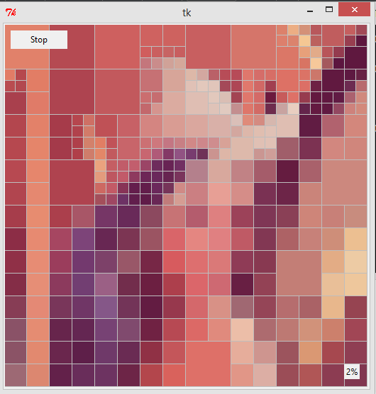

## DrawQuadTree #

A demo which uses quadtree to represent an image. The demo can either display the final result or show an animation of how the quadtree was generated.

### Introduction ###

This was inspired by another GitHub project: https://raw.githubusercontent.com/fogleman/Quad
I thought it was an interesting demo, and decided to build one for myself

### Prerequisite ###

* Requires the module [Pillow 2.5](https://pillow.readthedocs.org/en/latest/). It should work with PIL as well, given that Pillow is a fork of PIL.
* Tested using **Python 2.7x**. It should work fine with **2.6x**, but it does not support **Python 3.x**.
* Tested in **Windows 8.1**, but should work under earlier versions of **Windows** as well as **Linux** and **OSX**.

### How to run ###

The demo can display the quadtree in two modes:
* draw the final quadtree representation
* animate the creation of the quadtree.

Using the [Lenna](http://en.wikipedia.org/wiki/Lenna) test image, we can display the final output

```
>> python demo.py -f./path/to/Lenna.png -v300
```


To show an animatation of the quadtree creation while showing the quadtree boundaries,

```
>> python demo.py -f./path/to/Lenna.png -v300 -g -a
```

Press the "Stop" button to cancel the animation before exiting the demo.



### License ###
DrawQtree is released under the MIT license. See [LICENSE.txt](./LICENSE.txt)
